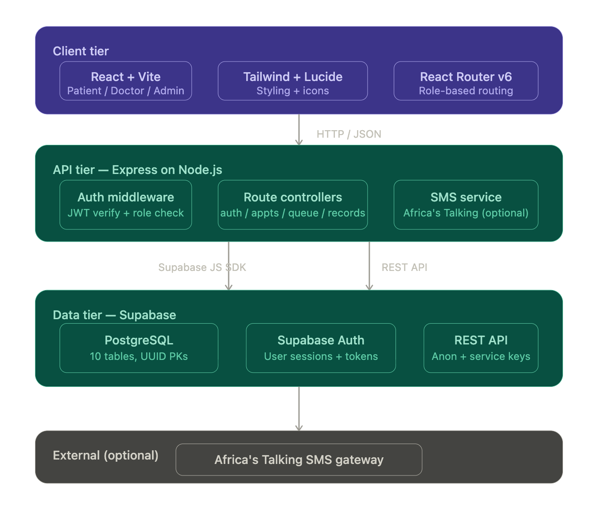
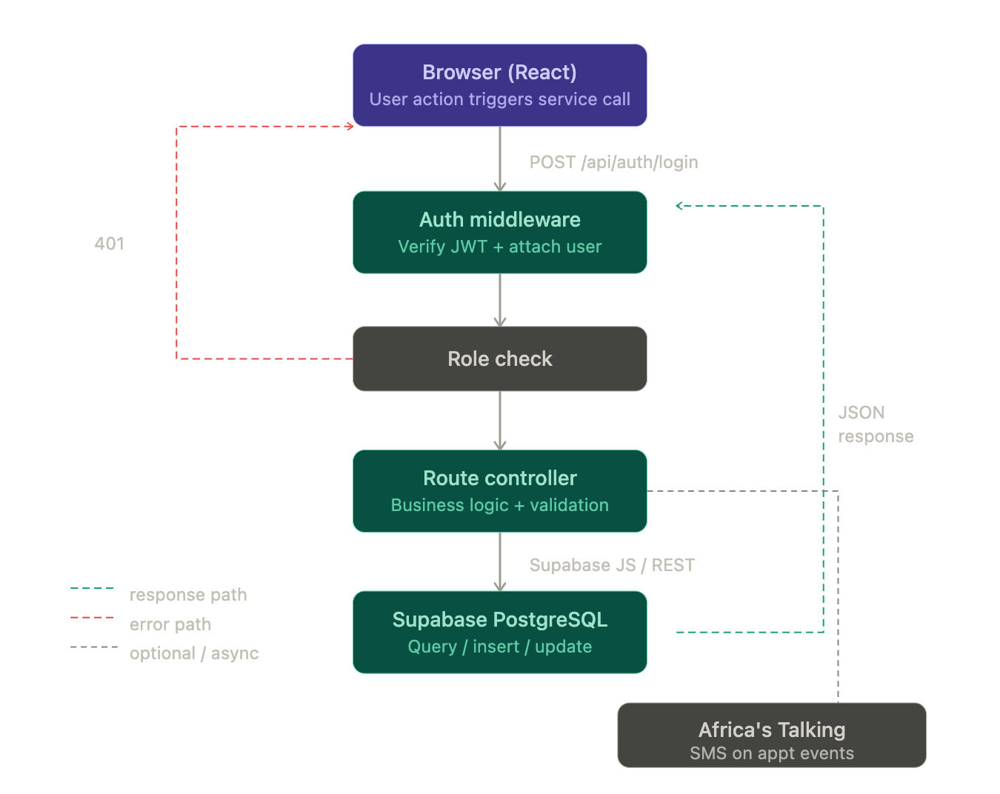
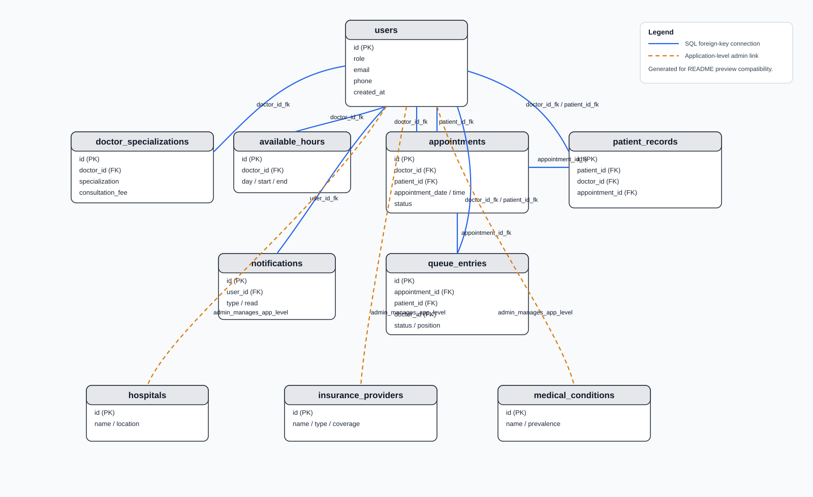
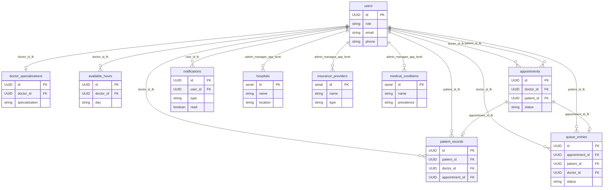

# KIE Smart Clinic

KIE Smart Clinic is a full-stack healthcare appointment and clinic operations system.

It includes:
- A React + Vite frontend for patients, doctors, and admins
- A Node.js + Express backend API
- Supabase (PostgreSQL + REST) integration for data persistence
- Optional SMS integration via Africa's Talking

## Demo Video

[](https://youtu.be/IDYTIbntwTQ)

## What This Project Covers

- Authentication and role-based access (patient, doctor, admin)
- Doctor discovery and appointment booking
- Appointment lifecycle management
- Patient records and queue workflows
- Notifications and system settings management
- Admin-managed hospitals, insurance, and condition settings

## Architecture

### 1. System Architecture (Frontend, API, Data, External)



### 2. Request Flow Architecture



## Repository Structure

```text
KIE-smart_clinic/
├── Backend/                    # Express API + Supabase integration
│   ├── src/
│   │   ├── controllers/
│   │   ├── routes/
│   │   ├── middleware/
│   │   └── db/
│   ├── tests/
│   ├── smart_clinic_schema.sql
│   └── seed-complete-data.js
├── frontend/                   # React/Vite application
│   └── src/
│       ├── pages/
│       ├── components/
│       ├── services/
│       └── context/
├── API_DOCUMENTATION.md        # Detailed API endpoint reference
└── README.md
```

## Backend Data Architecture (Preview)



If your Markdown viewer does not render Mermaid blocks, use the static ERD image above.



Notes:
- Connections labeled with `_fk` are SQL foreign-key relationships.
- Connections labeled `admin_manages_app_level` are application-level links (no direct SQL foreign key in the current schema).


## Tech Stack

### Frontend
- React 18
- Vite
- React Router v6
- Tailwind CSS
- Lucide React

### Backend
- Node.js
- Express
- JWT authentication
- Supabase JS + REST API
- Optional Africa's Talking SMS integration

### Testing
- Jest
- Supertest

## Prerequisites

- Node.js 18+ (recommended)
- npm 9+
- A Supabase project with API keys
- (Optional) Africa's Talking credentials for SMS features

## Local Setup

### 1. Clone and install dependencies

From project root:

```bash
# root-level dependencies (if needed by your workflow)
npm install

# backend
cd Backend
npm install

# frontend
cd ../frontend
npm install
```

### 2. Configure backend environment

In Backend:

```bash
cd Backend
cp .env.example .env
```

Set required variables in `Backend/.env`:
- `PORT` (default `3000`)
- `SUPABASE_URL`
- `SUPABASE_ANON_KEY`
- `SUPABASE_SERVICE_ROLE_KEY`
- `JWT_SECRET`

Optional SMS variables:
- `AT_API_KEY`
- `AT_USERNAME`

### 3. Configure frontend environment

In frontend:

```bash
cd frontend
cp .env.example .env
```

Set API URL used by the app service layer:

```env
VITE_API_URL=http://localhost:3000
```

If `frontend/.env.example` shows `REACT_APP_*` keys, treat them as legacy and use `VITE_API_URL` for the current Vite-based frontend.

Note: the frontend automatically prefixes requests with `/api`.

### 4. Initialize database schema

Use your Supabase SQL editor (or psql against your Postgres instance) to execute:

- `Backend/smart_clinic_schema.sql`

Optional demo data seed:

```bash
cd Backend
node seed-complete-data.js
```

## Run the Project

Use two terminals.

### Terminal 1: Backend API

```bash
cd Backend
npm run dev
```

Backend runs on `http://localhost:3000` by default.

Health check:

```bash
curl http://localhost:3000/health
```

### Terminal 2: Frontend

```bash
cd frontend
npm run dev
```

Frontend runs on `http://localhost:5173` by default.

## Available Scripts

### Backend (`Backend/package.json`)
- `npm run dev` - start backend with nodemon
- `npm start` - start backend with node
- `npm test` - run API tests (Jest/Supertest)

### Frontend (`frontend/package.json`)
- `npm run dev` - start Vite dev server
- `npm run build` - build production bundle
- `npm run preview` - preview production build locally

## API and Reference Docs

- Full endpoint docs: [API_DOCUMENTATION.md](API_DOCUMENTATION.md)
- Backend-focused setup notes: [Backend/setup-supabase.sh](Backend/setup-supabase.sh)
- Seed/demo credentials: [Backend/USERS_CREDENTIALS.md](Backend/USERS_CREDENTIALS.md)

## Core API Route Groups

All routes are under `/api` unless noted otherwise:

- `GET /health` (system + database health)
- `/api/auth`
- `/api/doctors`
- `/api/appointments`
- `/api/patient-records`
- `/api/queue`
- `/api/notifications`
- `/api/admin/system-settings`
- `/api/sms`

## Notes

- The frontend currently includes mock data files for prototyping in `frontend/src/data/mockData.json`, but the active API service is configured to use the backend.
- Do not use seeded/demo credentials in production.
- Keep `.env` files out of version control.
